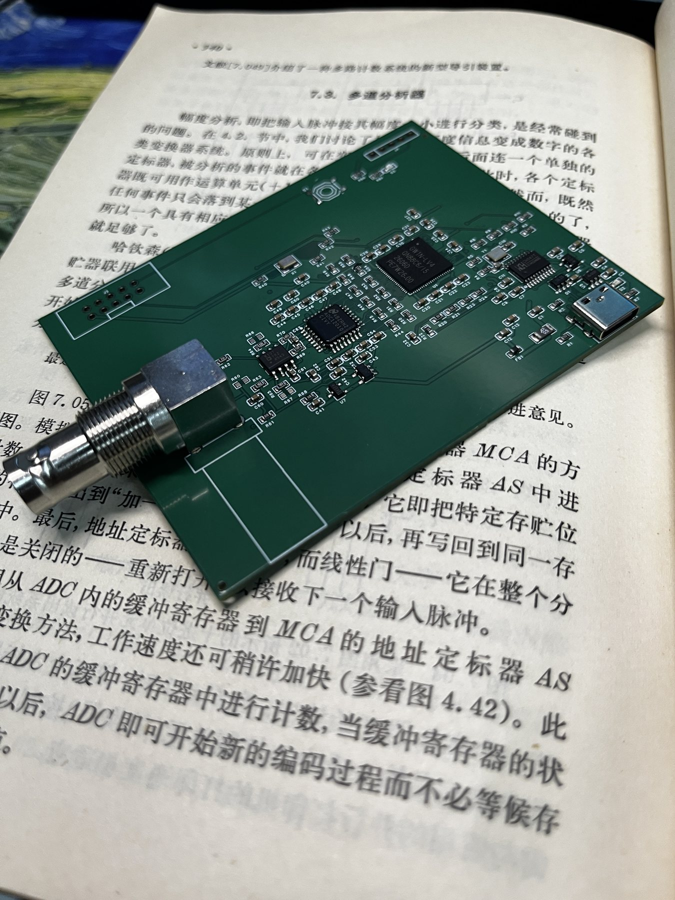
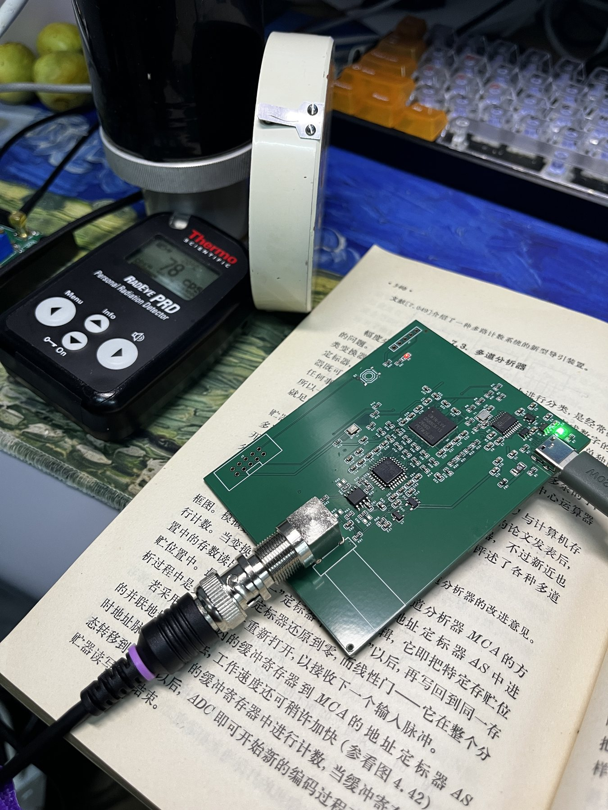
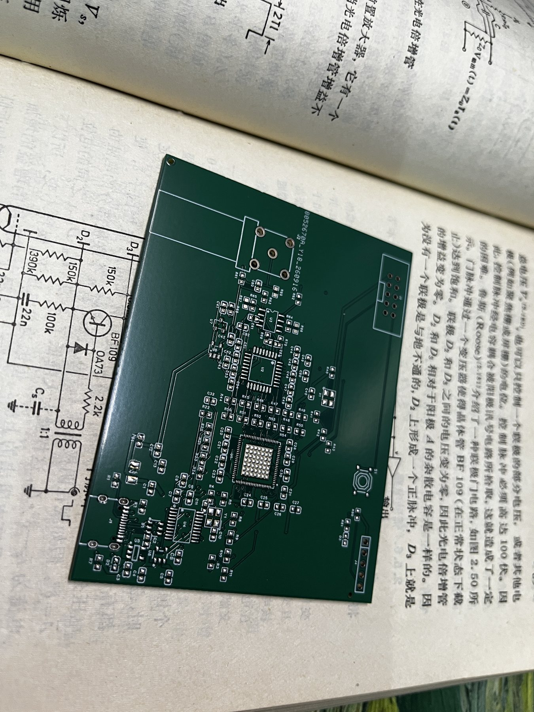
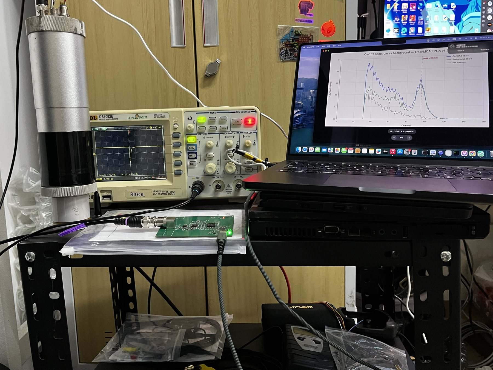
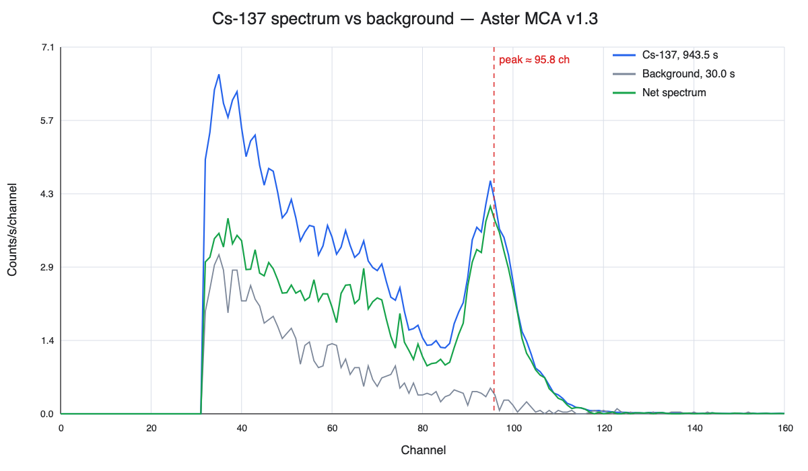
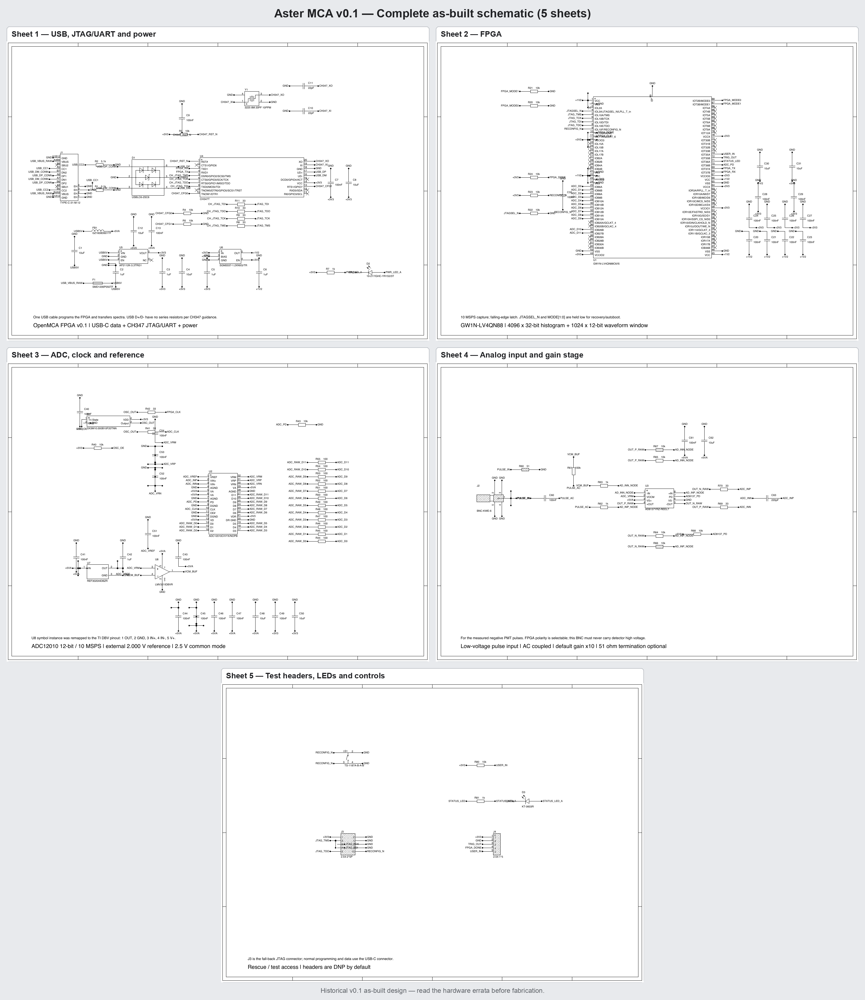
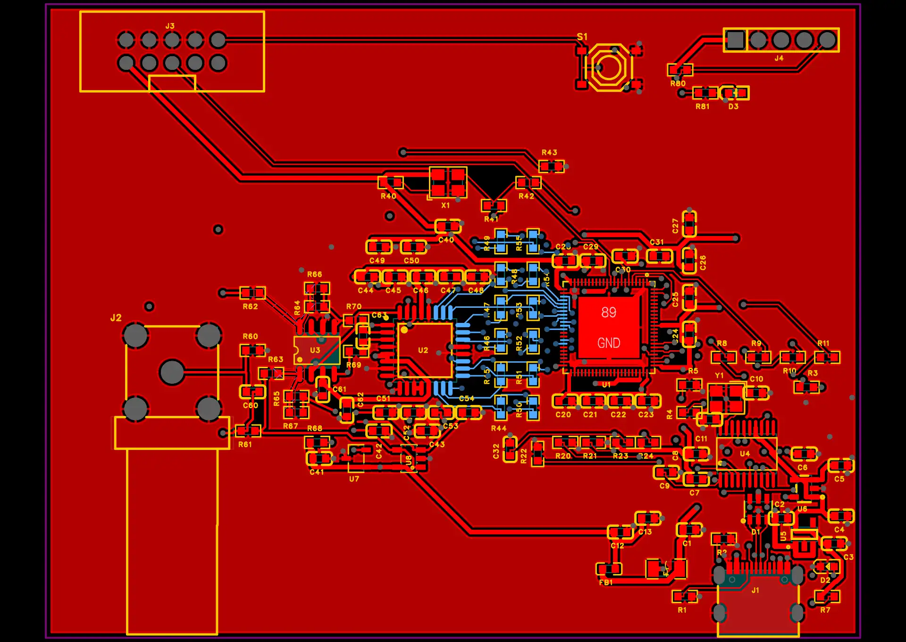

# Aster MCA

[English](README.md)

Aster MCA 是一块面向**已经过前置放大与调理的低压探测器脉冲**的紧凑型
4096 道多道分析仪。板上集成 12 位 10 MSPS ADC、Gowin GW1N-4 FPGA 和
CH347T USB/JTAG/UART 桥，单根 USB-C 完成供电、通信和 FPGA SRAM 配置。

> **当前状态：原型验证成功。** 修复后的 v0.1 实板已经用 NaI(Tl)/PMT
> 探头测得可重复的 Cs-137 能谱，但原始生产包有三项必须处理的装配说明。
> 请勿不加修改地直接下单，先阅读
> [v0.1 硬件勘误](docs/hardware-errata-v0.1.md)。



*已经完成实物验证的 v0.1 原型板。*

## 已经实现并实测的功能

- ADC12010 以 10 MSPS 采集 12 位并行数据；
- FPGA 完成基线跟踪、阈值触发、峰值提取、异常脉冲拒绝、饱和恢复和
  4096 × 32 位直方图；
- macOS 通过板载 CH347T 和 libusb 直接读谱，无需串口驱动；
- 同一根 USB-C 可通过 JTAG 将固件加载到 FPGA SRAM，无需独立烧录器；
- 可读出 ADC 当前值、基线、最小/最大值、触发数、接受/拒绝/饱和事件、
  丢失事件、有效采样时间和 UART 错误；
- 修复后的两块首板均已完成 USB 枚举、FPGA 配置和 ADC 数据链路验证。

当前固件版本为 **v1.3**。固件只加载进易失性 SRAM，断电后需要重新加载。

## 原型实物照片

| 通电运行中的原型 | 第二块 PCB 的装配与检查状态 |
| --- | --- |
|  |  |



完整测试系统包括带放大的 NaI(Tl)/PMT 探头、示波器、Aster MCA 原型板和
上位机。照片拍摄于最初的铯-137验证阶段，因此屏幕上的谱图仍显示公开改名前
使用的工程暂名。

## 首次实测结果

验证使用带内置放大器的 1 英寸 NaI(Tl)/PMT 探头和 Cs-137 检查源。模拟级
有效增益约为 ×3.33，阈值为 32 ADC 道，采集负向脉冲。

| 项目 | 结果 |
| --- | ---: |
| 带源有效采集时间 | 943.493 s |
| 带源总计数率 | 252.19 cps |
| 本底计数率 | 77.72 cps |
| 源净计数率 | 174.47 cps |
| 662 keV 峰位 | 约 95.8 道 |
| 初步 FWHM | 约 11.0 道 |
| 初步能量分辨率 | 约 11.5% |
| 直方图丢失事件 | 0 |

这些数据只代表一套原型装置，不能视为产品指标。分辨率来自单点能标、短时间
本底和简单的局部连续谱扣除。原始 CSV 数据位于
[`examples/cs137`](examples/cs137/)。



## 模拟增益配置

R62/R63 是两只配对的 1.00 kΩ `RG`，R64/R65 是已安装的配对 10.0 kΩ
`RF`。R66、R67 是分别与 R64、R65 **并联**的增益选配焊盘：两者都不装时
标称增益约为 ×10；同时装入相同阻值可以降低增益。本次铯-137实测在 R66、
R67 各安装一只 4.99 kΩ、0.1% 电阻，`10k || 4.99k ≈ 3.33k`，因此标称
增益约为 ×3.33。不能只安装其中一只，否则会破坏差分两侧的匹配。计算公式、
各电阻作用和重新标定要求见[模拟增益配置说明](docs/gain-configuration.md)。

## 安全边界

板上 BNC 是**低压信号输入**，不含探测器高压源、高压隔直网络或电荷灵敏前放。
严禁把 PMT 高压偏置线、裸 PMT、裸 SiPM 或带高压的探测器同轴线直接接入。

## 完整电路原理图

[](hardware/rev0.1-as-built/reference/Schematic.pdf)

上图把 v0.1 实板原理图的五页合并在一张图中；点击图片可打开原始高清 PDF。
这是首批实板的原始设计记录，因此仍包含 U8、S1 和 U6 的已知装配注意事项。
投产前请先阅读[硬件勘误](docs/hardware-errata-v0.1.md)。



## 快速使用

在 macOS 安装依赖：

```sh
brew install libusb openfpgaloader iverilog
```

给修复后的板卡加载已验证的 v1.3 固件：

```sh
cd firmware/mca-v1
openFPGALoader -c ch347_jtag --freq 1000000 -m \
  prebuilt/aster-mca-v1.3.fs
```

读取状态并采集 10 分钟能谱：

```sh
python3 astermca.py info
python3 astermca.py stats
python3 astermca.py acquire 600 --threshold 32 -o spectrum.csv
```

首次上电请按照 [`docs/bring-up.md`](docs/bring-up.md) 操作，不要立即连接探头。

## v0.1 必须处理的三项问题

1. **U8：** 原 BOM 中的 `LMV321IDBVR` 与 PCB 所假定的引脚排列不一致。
   应改装普通版 `MCP6001T-I/OT`，或采用勘误文档中的临时旁路方案。不能使用
   MCP6001R 或 MCP6001U 变体。
2. **S1：** 复位按键必须不装。该按键封装的触点配对会使 `RECONFIG_N`
   处于错误电平，导致 FPGA 无法正常配置。
3. **U6：** 新制板仍建议使用原设计的 `SGM2037-1.2XN5G/TR`。后续实验证明，
   代用的 `AP2112K-1.2` 不并联额外输出电容也能正常启动。额外并联电容不是
   常规要求；只有示波器确认 +1V2 上升沿过快并由此导致 FPGA 配置或启动失败时
   才考虑增加，同时必须重新检查稳压器稳定性、过冲和 FPGA 重复启动可靠性。

原始立创 EDA 工程、Gerber、BOM 和 CPL 均保留在
`hardware/rev0.1-as-built/`，用于复现、审计和后续修订；它们不是“可原样投产”
的定型文件。

## 生产文件档案

完整的 v0.1 实板生产档案可以直接下载：
[`Aster-MCA-v0.1-as-built-production.zip`](release/Aster-MCA-v0.1-as-built-production.zip)。
包内包括立创 EDA Pro 原生工程、Gerber、BOM、CPL、原理图、网表、引脚网络
对照表、贴装修正说明和硬件许可证。它保存的是首批实板的原始生产版本，并非
已经修正错误的定型版本；使用前必须先阅读包内说明和
[v0.1 硬件勘误](docs/hardware-errata-v0.1.md)。

## 参与贡献

欢迎提交 HDL 审查、其他探头的实测数据、Linux/Windows 上位机支持、模拟前端
优化以及修正版硬件。提交前请阅读 [CONTRIBUTING.md](CONTRIBUTING.md)。

## AI 辅助开发披露

FPGA 固件、HDL 测试、Python 上位机以及部分技术文档在 OpenAI
Codex/ChatGPT 的协助下完成。发布内容随后经过 HDL 仿真、完整综合与布局布线、
时序分析和实板运行验证。完整说明见 [AI 使用披露](AI-DISCLOSURE.md)。

## 许可证

硬件设计文件采用 CERN-OHL-P-2.0；固件、上位机、文档、测试、图片和示例
数据采用 MIT。适用范围和完整许可证文本见 [LICENSE.md](LICENSE.md)。
