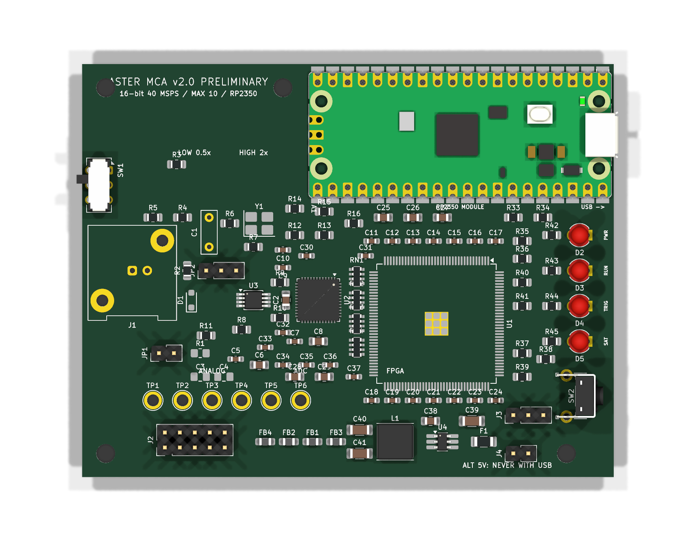

# Aster MCA v2.0 high-performance concept

This directory publishes the current **r8 engineering design** for a higher-
performance Aster MCA. It is a routed, auditable hardware concept, not a
released production design.

> **Do not order this revision as a finished instrument.** The schematic and
> PCB are internally consistent, but there is no MAX 10 firmware or physical
> prototype yet. Read [PRODUCTION-NOTICE.md](PRODUCTION-NOTICE.md) first.

## Design direction

| Block | Current r8 choice |
| --- | --- |
| ADC | TI ADS5560, 16 bit, 40 MSPS, parallel CMOS output |
| FPGA | Intel MAX 10 10M16SAE144C8G, internal configuration flash, no external DDR |
| Host | Direct-soldered 52 mm x 21 mm RP2350/Pico 2-compatible castellated module |
| Analogue driver | TI THS4551 fully differential amplifier |
| Input ranges | Nominal 0.5x, 5x and 25x selected by a board-edge DP3T switch |
| Board | 90 mm x 70 mm, four layers, solid internal ground plane |
| User interface | Board-edge reset/reconfigure switch and four 3 mm through-hole LEDs |

The FPGA is intended to capture the complete 16-bit ADC bus and perform
triggering, baseline tracking, pulse-height/area extraction, pile-up handling,
histogramming and event buffering. The RP2350 module is intended to provide
USB, configuration, control and higher-level data transfer. Firmware for this
architecture has not yet been implemented.

## Three-range front end

The present resistor network provides three repeatable fixed ranges rather
than a dual potentiometer whose channel tracking and wiper noise would be hard
to calibrate:

| Range | Signal-side nominal gain | Intended use |
| --- | ---: | --- |
| Low | 0.5002x | Bring-up and occasional multi-volt detector pulses |
| Medium | 4.9665x | General spectroscopy range |
| High | 25.413x | Weak and low-energy pulses |

The reference-side gains are 0.5000x, 4.9751x and 25.413x. These are circuit
ratios for negligible detector source impedance, not energy-calibration
constants. Every assembled range requires pulse-injection and source
calibration. The 25x range is not presently qualified for multi-volt overload;
begin first power-up on 0.5x.

See [GAIN-OPTIMIZATION-r7.md](reference/GAIN-OPTIMIZATION-r7.md) for the exact
network and safety limits.

## Analogue simulation and r8 correction

The THS4551 front end was exercised with TI's PSpice macro-model. The original
10 ohm ADC isolation resistors showed a 9.74 dB simulated resonance near
35.5 MHz with the present 2.2 nF differential capacitor. r8 changes both
resistors to 22 ohm. The rerun produced approximately 1.56-1.65 MHz bandwidth,
less than 0.46 us simulated 1% settling, and no observed AC peaking in all
three ranges.

This model does not reproduce the ADS5560 switched-capacitor input, so the
result is a design check rather than a substitute for oscilloscope validation.
See [DAMPING-FIX-r8.md](reference/DAMPING-FIX-r8.md) and the reproducible files
under [`simulation/r7/`](simulation/r7/).

## Current verification status

Fresh checks against the r8 editable source on 2026-09-26 report:

- schematic ERC: 0 errors and 0 warnings;
- PCB DRC: 0 violations, 0 unconnected pads and 0 footprint errors;
- 111/111 manifest references present;
- all 489 numbered pad/net assignments match the independent manifest;
- critical FPGA/ADC clock, THS4551, AP63203, gain-switch and ADC-input networks
  pass the static audit;
- all four copper layers are present, with In1.Cu reserved as the solid ground
  plane.

These checks prove CAD consistency, not physical operation.

## Remaining release gates

1. Build and compile an exact `10M16SAE144C8G` Quartus project, proving package
   pin legality, ADC timing and the RP2350 interface.
2. Overlay the exact purchased 52 mm x 21 mm RP2350 clone on a 1:1 print and
   verify every castellated contact and USB overhang.
3. Verify the purchased JS203011AQN switch continuity and physical slider
   order before printing enclosure labels.
4. Bind every fitted BOM line to an exact purchasable part and recheck stock.
5. On a prototype, measure all rails, total USB current, ADC clock/data timing,
   front-end settling, overload recovery and range gain.
6. Repeat native EasyEDA/JLCPCB DRC, paste, rotation and 3D review before any
   assembly order.

## Files worth reviewing

- `source/Aster-MCA-v2.0.kicad_sch` and `.kicad_pcb` — current editable r8
  design and routing authority;
- `source/footprints/` — project-local production footprints;
- `reference/Aster-MCA-v2.0-schematic.pdf` — rendered schematic;
- `reference/parts-manifest.json` and `netlist-pin-map.csv` — independent
  connectivity references;
- `reference/quartus-pin-assignment-preliminary.csv` — preliminary MAX 10
  signal assignments, still requiring compilation;
- `production/quote-r8-current-source/` — quote-only Gerbers, BOM and CPL;
- `simulation/r7/` — analogue simulation and static-audit scripts and results.

The quote package is deliberately labelled **QUOTE ONLY**. It exists to study
cost and assembly options; it is not a production release.
